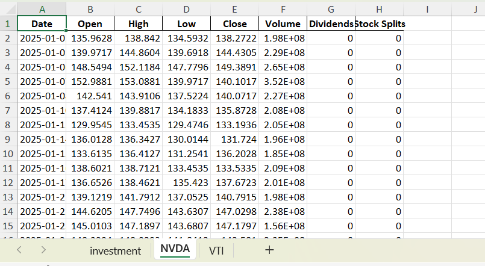
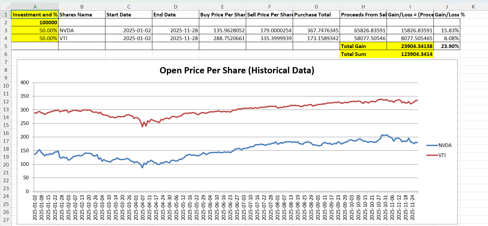

# 📈 Portfolio Gain Calculator

## 📝 Overview
In this example, the gains (from a made-up portfolio) are calculated for a given test date range.  
Basically that what you would see with your investment account.

---

## Scenario and Steps
The scenario assumes an investment of **$1000 into few stocks** at the start of **2025**, sold at the end of the year (**Dec 2025**).

### Steps:
1. **Read active stock historical data** using Yahoo Finance via python script.  
2. **Save results into Excel**, where each stock’s historical data is stored in its own sheet named after the stock symbol

3. **Create Excel macros** that generate an `investment` sheet with the following grid 📊


⚙️ User Interaction
- Users can **change Investment and %**, **Start Date**, and **End Date** to see how gains differ.  
- The formulas in the excel (inserted by macros) dynamically update calculations based on user input.

📈 For reference, a chart is generated that shows the **historical data for all shares in the portfolio** to visualiz the performance trends across the selected date range.

---

## 🚀 Instructions

### Python Environment Setup
```
# Used python version
python --version
Python 3.11.9

# From Documents\qa-playground>
# setup virtual env
python -m venv ..\..\PyEnvs\PortfolioAnalysis 

# Open virtual environment
Set-ExecutionPolicy Unrestricted -Scope Process
..\..\PyEnvs\PortfolioAnalysis\Scripts\Activate.ps1

# Install packages
cd .\proposals\portfolio_analysis\
pip install -r requirements.txt
```

### Excel Creation (With Yahoo Finance Data)
Run python script [excel_portfolio_data_from_yfinance.py](excel_portfolio_data_from_yfinance.py).
For now if you want to change list of stocks and date range set them in the [setup_portfolio.py](setup_portfolio.py)
```
portfolio_list = ["NVDA", "VTI"]
interval="1d"
(start, end) = ("2025-01-01", "2025-10-31")
```
change those values in the script you are about to run
```
# Generate excel with data from Yahoo Finance
python .\excel_portfolio_data_from_yfinance.py
```
### Excel Analysis Setup
Run [excel_macros.bas](excel_macros.bas)
1. Open generated excel and press **Alt + F11** to open the VBA editor
2. **File -> Import File** and select excel_macros.bas
3. Open imported PortfolioAnalysis module and Run it from the VBA editor

---

## ✅ Key Features
- Automated retrieval of stock data via Yahoo Finance using python script.  
- Organized Excel sheets per stock symbol using python script.  
- Macro-driven `investment` sheet with gain/loss calculations.  
- Chart for portfolio performance visualization.  
- Flexible inputs for investment amount and date ranges.

---

## 📌 Future Improvements
- Add reading list of stocks from either plain text file or from command line
- Add prediction ability based on the **historical data for all shares in the portfolio**.  
